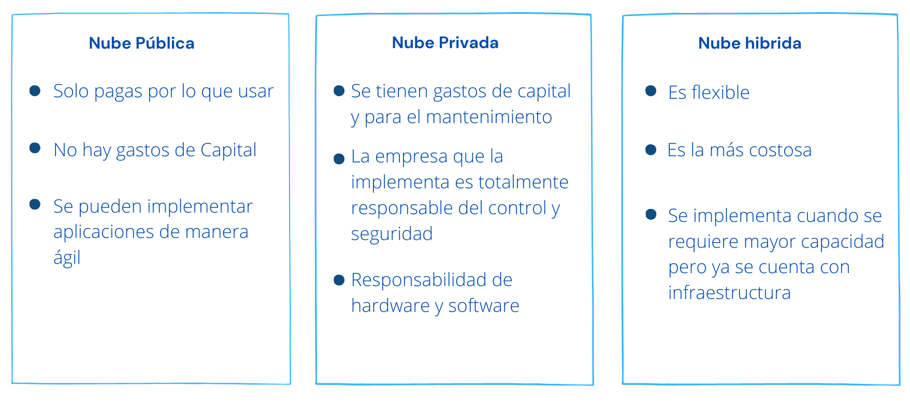

#  SummerCloud Grupo-2 :palm_tree: :sun_with_face: :surfer:

# Conceptos básicos de Azure :cloud:

## Informatica en la nube 

La informatica en la nube es ofrecer servicios informaticos a tráves de Internet los cuales podemos implemetar de acuerdo a nuestras necesidades y requerimientos, y lo mejor de todo es que solo pagas por lo que usas.

**¿Por qué debería migrar a la nube?**
La nube ahora ofrece muchos servicios tanto para desarrolladores, para realizar implementaciones de manera más rápida, como a empresas para poder optimizar su procesos, lo que antes parecia imposible con la nube es una realidad y esto es solo el comiezo. 

## Azure 

[Azure](https://portal.azure.com) es la nube de Microsoft, la ofrece una gran variedad de servicios que ayudan a las empresar a poder completar los desafios del mundo actual, estamos en la era digital. 

Azure nos ofrece: 
* Innovació continua
* Admite todos los lengaujes y marcos 
* Integración de la  nube hibirda 
* Seguridad 
  
## Servicios de Azure

Azure ofrece muchos servicios los cuales se clasifican en las siguientes categorias:

| Categoria de Servicios||
|-------------------------------------------------------------------------- | --------------- |
| Proceso    |  Web|  
| Redes|  IoT |
| Almacenamiento|Macrodatos|
| Móvil|IA|
|Bases de datos|DevOps|

     
Aquí [Servicios de Azure](https://azure.microsoft.com/es-mx/services/) puedes encotrar más información sobre todos los servicios que ofrece Azure.

## Cuentas de Azure 

Bien para poder utilzar los servicios de Azure debemos contar con una cuenta Azure la cual se asocia a una o varias suscripciones, esta cuenta permitira interactuar con los servicios que Azure ofrece.

Para conocer la variedad de servicios ofrece una cuenta gratuita que da acceso gratuito por 12 meses sole debe contar con un número de teléfono, tarjeta de credito y una cuenta Microsoft. Y también ofrece cuentas de estudiantes por ejemplo en Innovacción nosotros tenemos acceso a una cuenta de estudiantes. 

## Tipos de modelos en la nube
### ¿Qué son las nubes pública, privada e híbrida?

 
    <strong></strong>
    </strong>

### Comparación de modelos de nube

 
    <strong></strong>
    </strong>

### Ventajas de la informática en la nube

 
    <strong></strong>
    </strong>

### Gastos de capital en comparación con los gastos operativos

| CapEx| OpeEx|
|-------------------------------------------------------------------------- | --------------- |
| Cuando se hace una fuerte inversión inicial en infraestructura la cual va perdiendo su valor con el tiempo y se tiene que invertir constantemente  para mantenerla.| El dinero se invierte en productos y servicios que se deben pagar de acuerdo al uso que se le de y puede ser facturado rápido.  

### Modelo basado en el consumo

Los proveedores de servicios en la nube operan en un modelo basado en el consumo, lo que significa que los usuarios finales solo pagan por los recursos que usan. Lo que usan es lo que pagan.

* No se paga por adelantado 
* No es necearia una infraestructura costosa
* Puedes agregar recursos adicionales cuando lo necesites 
* Puedes dejar de pagar un recurso que ya no necesitas

## ¿Qué son los modelos de servicio en la nube?

| Modelo| Definición| Descripción|
|-------------------------------------------------------------------------- | --------------- |--------------- |
| IaaS| Infraestructura como servicio| Se adquila hardware, en vez de compralo.  |
| PaaS| Plataforma como servicio| Entorno de hospedaje, ya que como usuario solo te preocupas por el desarrollo de aplicaciones. |
| SaaS| Software como servicio| Aplicación a la que normalmente accedes con un credenciales y pagas un sucripción mesual o anual.|

### Niveles de responsabilidad entre un proveedor de servicios en la nube y un inquilino de nube

 
    <strong></strong>
    </strong>

## ¿Qué es la informática sin servidor?

Cuando se  habla de informática sin servido hace referencia a que como un usuario desarrollador ya no tienes que preocuparte por la infraestructura. Esta arquitectura es esclable y controlada por eventos, solo se usan recuros cuando ocurre una función o un desencadenador lo que permite llevar con rápidez productos al mercado, optimizando. 

## Estructura organizativa de los recursos en Azure

 
    <strong></strong>
    </strong>

## Zonas de disponibilidad, pares de regiones y regiones de Azure

### Regiones de Azure

Una área geografica en el planeta donde hay al menos un centro de datos o más, conectados mediante una red de baja latencia. Estas regiones las elegimos a la hora de implementar algún servicio de Azure, lo recoendable es que sea el más cercano a nosotros para obtener una mejor escalabilidad y redundacia.

**Ejemplos de regiones:** 
* Oeste de EE. UU.
* Centro de Canadá
* Europa Occidental
* Este de Australia 
* Japón Occidental. 

**Regiones de Azure especiales**

* US DoD (centro), US Gov Virginia, US Gov Iowa y más.
* Este de China, Norte de China y más.

### Zonas de disponibilidad de Azure

Una zona de disponibilidad son centros de datos separados en una misma región, por si un centro de datos falla, el otro seguira trabajando. Las zonas de disponibilidad están conectadas a través de redes de fibra óptica de alta velocidad privadas.

| Servicios de Azure que admiten zonas de disponibilidad  |Ejemplos |
|-------------------------------------------------------------------------- | --------------- |
| **Servicios de zona**    |  Ancle el recurso a una zona específica (por ejemplo, máquinas virtuales, discos administrados, direcciones IP).|  
| **Servicios de redundancia de zona**|   La plataforma se replica automáticamente entre zonas (por ejemplo, almacenamiento con redundancia de zona, SQL Database). |

### Pares de regiones de Azure

Azure empareja regiones que se encuetran en una misma zona geográfica a un a distacia aproximada de 500 km. Esto le permite replicar recursos lo que ayuda a garantizar que si una de las regiones falla, al instante se podrá trabajar con la otra región 

Algunos pares de regiones de ejemplo en Azure son Oeste de EE. UU. y Este de EE. UU., o Sudeste Asiático y Asia Pacífico.

## Recursos de Azure y Azure Resource Manager

## Suscripciones y grupos de administración de Azure
