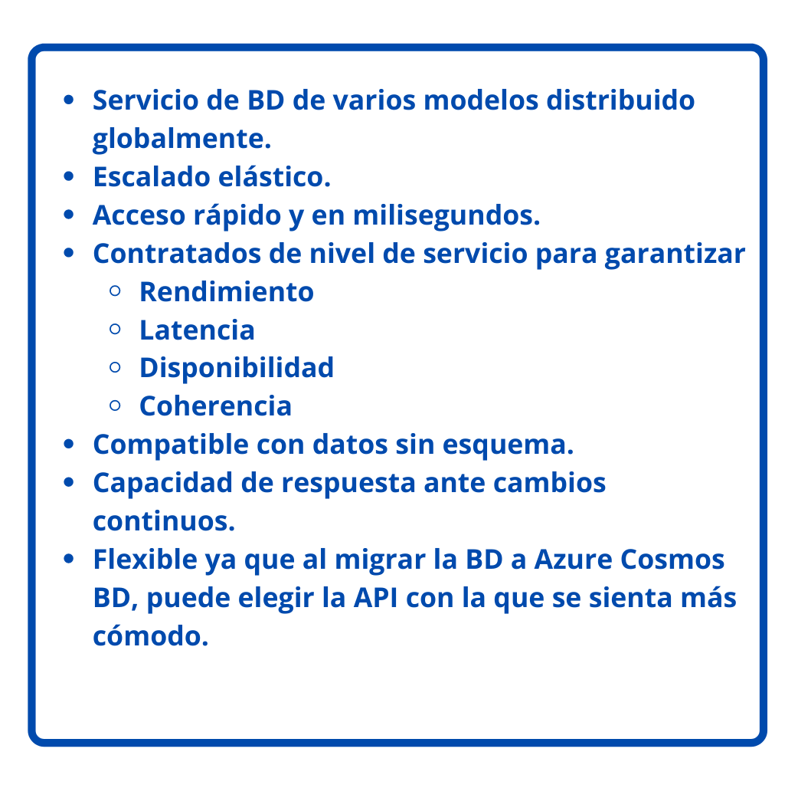
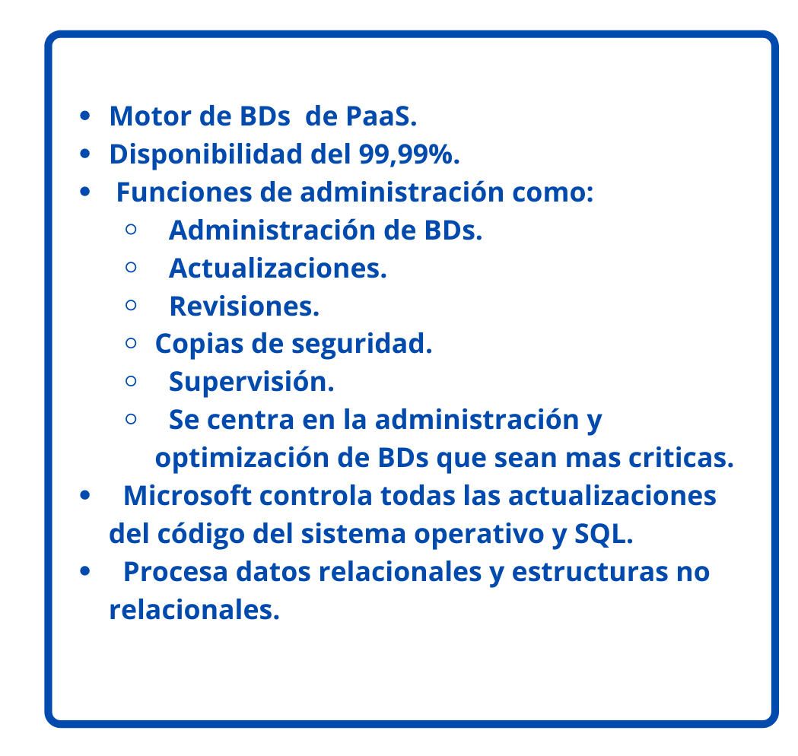
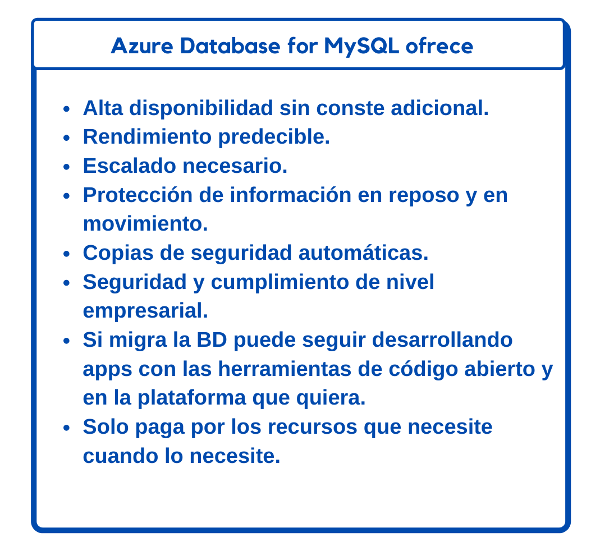
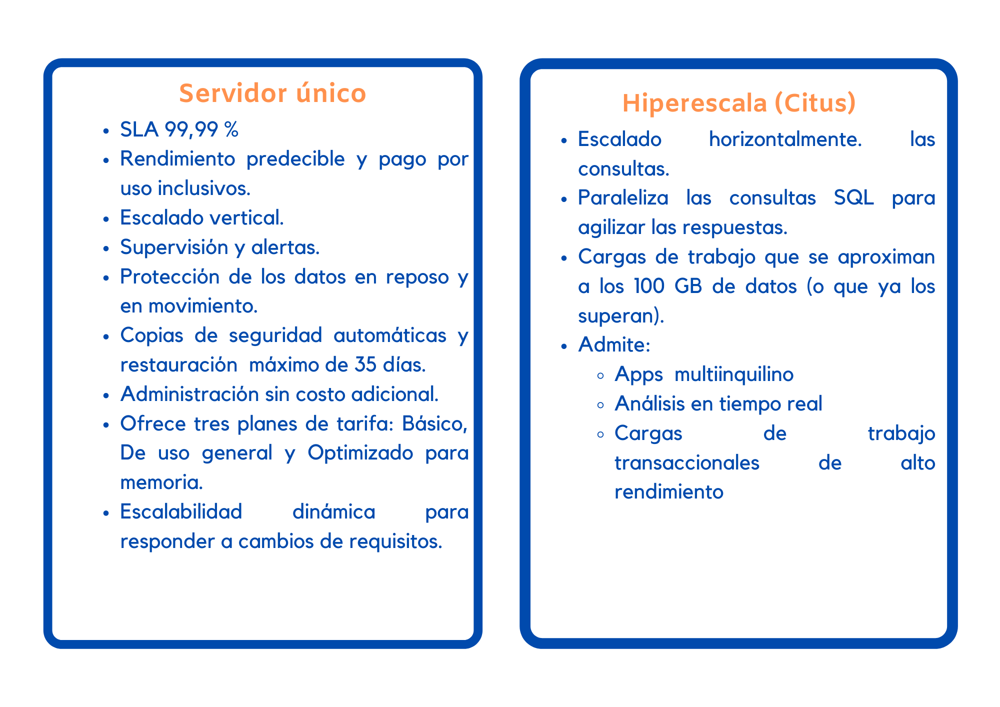

## Azure Cosmos DB

 
    <strong></strong>
    </strong>

## Azure SQL Database

 
    <strong></strong>
    </strong>

### Migración

**Azure Database Migration Service:** Puede migrar las BDs existentes de SQL Server con un tiempo de inactividad mínimo.
**Microsoft Data Migration Assistant:** Puede generar informes que proporcionan recomendaciciones antes de realizar la migración.

## Azure Database for MySQL
* Servicios de BDs relacionales.
* Se basa en el motor MySQL Community Edition, versiones 5.6, 5.7 y 8.0
* Nivel de servicio de disponibilidad del 99,99 %.
* Puede utilizar la restauración, con un plazo máximo de 35 días.
*  Azure Database for MySQL es la opción lógica para las aplicaciones de pila LAMP
  
 **Azure Database for MySQL ofrece:**

 
    <strong></strong>
    </strong>

## Azure Database for PostgreSQL

* Servicio de BDs relacional.
* Se basa en la versión de la comunidad del motor de BDs de PostgreSQL de código abierto. 

### Ventajas de Azure Database for PostgreSQL:
* Alta diponibilidad las aplicaciones siempre están disponibles.
* Precios sencillos y  flexibles: los beneficios van de acuwrdo al plan de tarifa  que elija.
* Escalado vertical para que concida con el uso que se le da servicio.
* Copias de seguridad automáticas ajustables y restauración con un máximo de 35 días.
* Seguridad para porteger infromación en reposo y en movimiento.

Servidor único e Hiperescala (Citus)

 
    <strong></strong>
    </strong>

## Azure SQL Managed Instance
* Servicio de datos en la nube.
* Mayor compativilidad con el motor SQL Server.
* PaaS
* Aprovicionamiento rápido y escalado de servicio de Azure.
* Actualizaciones de versiones  y revisiones.
* Alta diponibilidad.
* SLA del 99,99 %.
* Automatización de copias de seguridad.
* Copias de seguridad 

### Migración
Azure SQL Managed Instance facilita la migración de los datos locales en SQL Server a la nube con Azure Database Migration Service (DMS) o copias de seguridad y restauración nativas.

 
    <strong></strong>
    </strong>

## Análisis y macrodatos

 
    <strong></strong>
    </strong>

# :house: [Regresar](https://github.com/JazminQuino/SummerCloud-Grupo-2/blob/main/contenido/semana_dos.md)