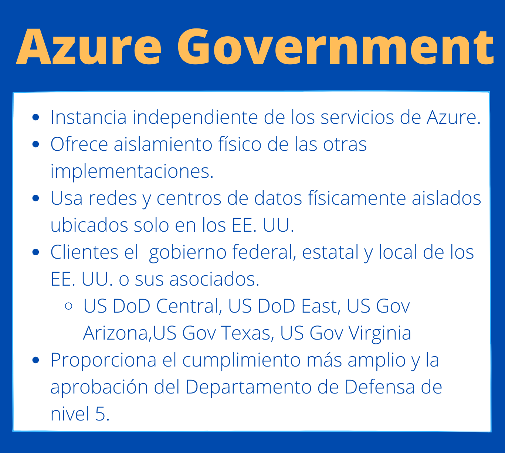

# Examine los estándares de privacidad, cumplimiento y protección de datos en Azure

 
    <strong></strong>
    </strong>

 ## Centro de confianza

 Presenta los principos de Azure para mantener la integridad de los datos en la nube y la manera en que Microsoft implementa y admite la seguridad, la privacidad, el cumplimiento y la transparencia en todos los servicios y productos de nube de Microsoft. 

 El Centro de confianza proporciona:
 * Información detallada sobre seguridad, privacidad, oferta de cumplimiento, directivas y procedimientos de productos de la nube.
 * Recursos adicionales.
 * Vínculos con los blogs de seguridad, privacidad y cumplimiento.
* El Centro de confianza es un excelente recurso para las personas de la organización que podrían desempeñar un papel importante en la seguridad, la privacidad y el cumplimiento

## Documentación de cumplimiento de Azure.

Nos proporciona documentación detallada dobre el cumplimiento y los estandares legales y normativos.

Categorias de documentación:
* Global
* Gobierno de EE. UU.
* Servicios financieros
* Sanidad
* Soporte físico y fabricación
* Regional

## Azure Government

 
    <strong></strong>
    </strong>

## Azure China 21Vianet

 
    <strong></strong>
    </strong>

# :house: [Inicio](https://github.com/JazminQuino/SummerCloud-Grupo-2)