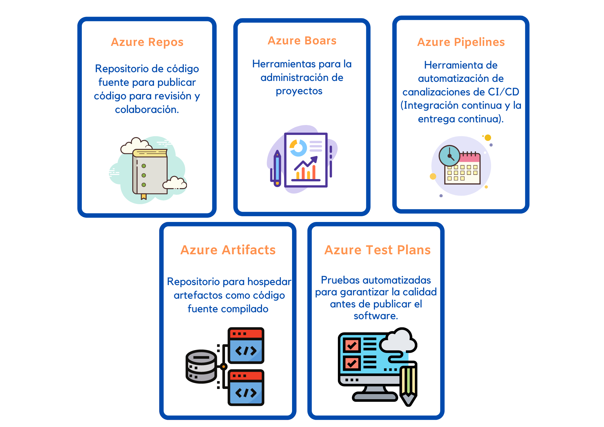

# Elección de las mejores herramientas para ayudar a que las organizaciones creen mejores soluciones

## Azure DevOps Services

Azure DevOps Services es un conjunto de servicios que aborda cada fase del ciclo de vida de desarrollo de software:

 
    <strong></strong>
    </strong>

## Azure DevTest Labs

Un **medio automatizado** para administrar el proceso de compilación, configuración y anulación **de MVs** que contienen las compilaciones de los proyectos de software.

* Realize pruebas en diferentes entornos y compilaciones.
* Puede configurar todo automáticamente a petición.
* Puede apagar y desaprovisionar la máquina virtual,cuando ya nos use o necesite más.
* Automatizar la creación y la administración de un entorno de laboratorio de pruebas.