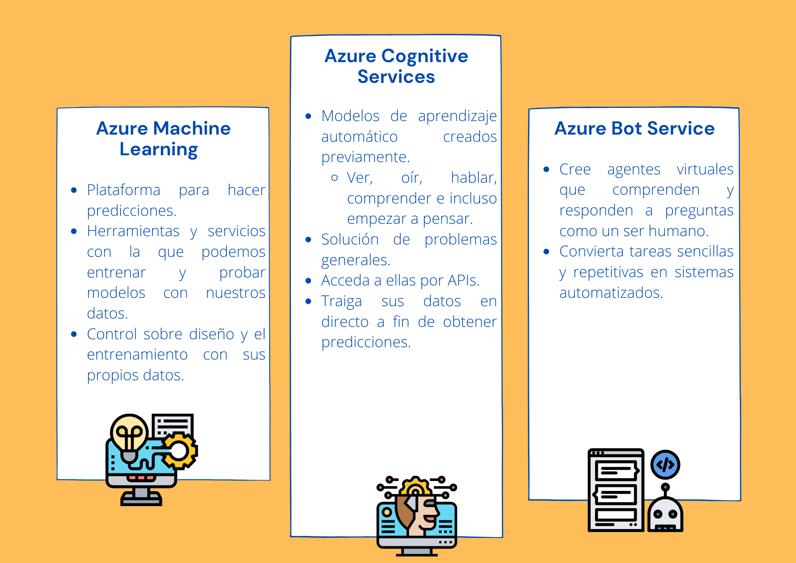

# Elija el mejor servicio de IA para sus necesidades

 
    <strong></strong>
    </strong>

Con **Azure Machine Learning**, puede realizar lo siguiente:
* Obtención de datos los que puedan servir para entrenamiento, los incorrectos, incompletos, etc.
* Con herreamientas y lenguajes de programación entrenar y probar modelos predictivos.
* Deinir cuándo y dónde los datos en función de entrenamiento o prueba se procesan por medio la creación de canalizaciones.
* Algoritmos de mejor rendimiento que se puedan utilizar en tiempo real.
  
# :house: [Inicio](https://github.com/JazminQuino/SummerCloud-Grupo-2)