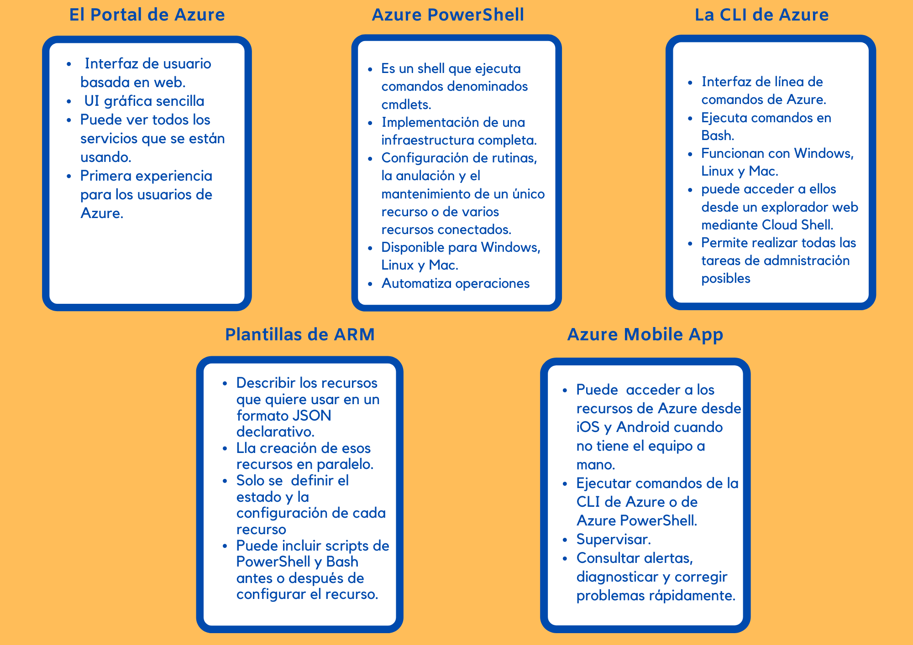

# Elección de las mejores herramientas para administrar y configurar el entorno de Azure.

Microsoft ofrece una variedad de herramientas y servicios para administrar el entorno en la nube, cada uno de ellos dirigido a distintos escenarios y usuarios.

 
    <strong></strong>
    </strong>

## Análisis de los criterios de decisión.

### Azure Portal
 * Está aprendiendo a usar Azure o tiene que configurar y administrar recursos con poca frecuencia.
 * Acciones puntuales de administración, gestión o creación de informes.
### Azure PowerShell
* Proviene de un entorno de administración de Window.
* Realizar tareas puntuales.
* 
### CLI de Azure
* Proviene de un entorno de administración de Linux.
### Azure Mobile App
* Cuando no tenga a mano ningún portátil y necesite ver y evaluar problemas de inmediato.
### Plantillas de ARM

* Necesita una forma de configurar repetidamente uno o más recursos y asegurarse de que todas las dependencias se crean en el orden adecuado.
* Medio confiable y repetible para implementar toda la infraestructura.

# :house: [Inicio](https://github.com/JazminQuino/SummerCloud-Grupo-2)