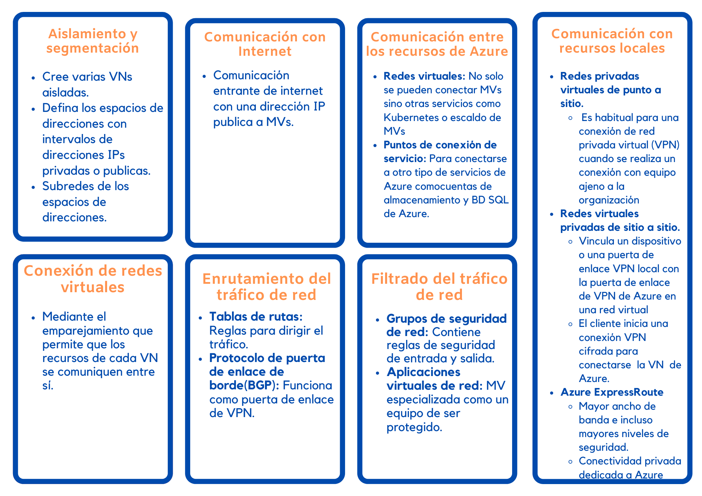
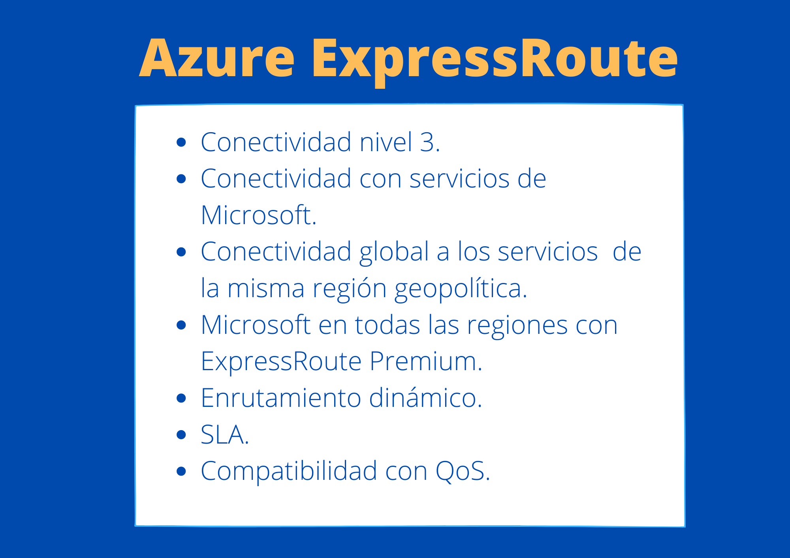

# Servicios de red de Azure :globe_with_meridians:

## Azure Virtual Network

### ¿Qué son las redes virtuales de Azure?

Son con las cuales los servicios de Azure se peuden comunicar entre si, con los usuarios a traves de Interne y los entorno locales del cliente.

Las redes virtuales de Azure proporcionan las importantes funcionalidades de red siguientes:

 
    <strong></strong>
    </strong>

## Azure VPN Gateway

### Puertas de enlace de VPN
Las instacias de Azure VPN Gatewat se implementan en istacias de Azure VN,
* Conecte los centros de datos locales a VN a través de una conexión de *sitios a sitio*.
* Conecte dispositivos individuales a VN a través de una conexión *punto a sitio*.
* Conecte VN a VC con conexión entre  *redes* 
  

Con Azure VPN Gateway
* Los datos trasferidos se cifran en un túnel privada cuando viajan a trvés de internet.
* Solo se puede hacer una intacia de Azure VPN Gateway por VN.
  
### Tipo de red privada virtual

 
    <strong></strong>
    </strong>

 
## Azure ExpressRoute
* Si quiere ampliar las rede locales a la nube de Microsoft
* Las conexiones de ExpressRoute no pasan por la red publica de Internet.
* Conexión privada de la infraestructura local a la infraestructura de Azure.
*  Proporciona conectividad privada, pero esta no está cifrada.
  
Modelo de interconexión de sistemas abiertos (OSI):
- **Nivel 2 (L2):** nivel de vínculo de datos, que proporciona una comunicación de nodo a nodo entre dos nodos de la misma red.
- **Nivel 3 (L3):** nivel de red, que proporciona el direccionamiento y enrutamiento entre los nodos de una red de varios nodos.

### Características y ventajas de ExpressRoute

 
    <strong></strong>
    </strong>

* Con **Global Reach de ExpressRoute**, puede conectar sus centros de recursos privados a través de dos circuitos ExpressRoute. El tráfico de los centros de datos viajará a través de la red de Microsoft.

### Modelos de conectividad de ExpressRoute

* Ubicación de CloudExchange
  * Se ofrece conexión nivel 2 y 3 entre la infraestructura.
* Conexión Ethernet de punto a punto
  * Conectividad de nivel 2 y nivel 3 entre el sitio local y Azure.
* Conexión universal
    * Integrar la red de área extensa (WAN) con Azure 
