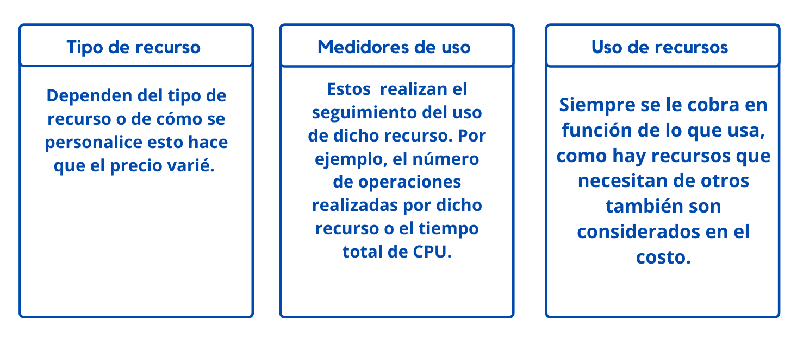

# Planeación y administración de los costos de Azure

**TCO**: Costo Total de Propiedad 

## Calculadora de TCO
* Le ayuda a calcular cuanto dinero puede ahorra al implementar su solución en Azure,
* Especifique los cargas de trabajo de su entorno en la calculadora y podrá obtener un informe de lo que le costaria en Azure.

## ¿Cómo funciona la calculadora de TCO?

 
    <strong></strong>
    </strong>

## Comprar servicios de Azure

 
    <strong></strong>
    </strong>

## ¿Qué factores afectan al costo?

 
    <strong></strong>
    </strong>

## ¿Afecta el tráfico de red o la ubicación al costo?

### Location
* Azure se distribuye globalmente lo que le permite implementar servicios a localizaciones cercanas a los clientes.
* Las regiones pueden tener distintos precios, por la zonas geográficas. 
### Zonas para la facturación  del tráfico de red
Algunas de las transferencias de datos entrantes son gratis mientras que el precio las transferencias de datos salientes puede variar por las zonas.
 
**Zona 1:** Centro de Australia, Oeste de EE. UU., Este de EE. UU., Oeste de Canadá, Oeste de Europa, Centro de Francia y otras
**Zona 2:** Este de Australia, Japón Occidental, Centro de la India, Sur de Corea del Sur y otras
**Zona 3:** Sur de Brasil, Norte de Sudáfrica, Oeste de Sudáfrica, Centro de Emiratos Árabes Unidos, Norte de Emiratos Árabes Unidos
**Zona 1 de Alemania:** Centro de Alemania y Nordeste de Alemania
## ¿Cómo puedo calcular el costo total?

* Calculadora de precios 
    * Muestra por categoría los productos de Azure, puede agregar las en sus configuración y varias las configuraciones para obtener esimaciones de costos.
    * Obtendra un informe detallado en realción a cada recurso que ha agregado a la solución. 
    * Algunos ejemplos de configuración son:
      * Región
      * Nivel
      * Opciones de soporte técnico

## Administrar y minimizar el costo total en Azure

 
    <strong></strong>
    </strong>

# :house: [Inicio](https://github.com/JazminQuino/SummerCloud-Grupo-2)