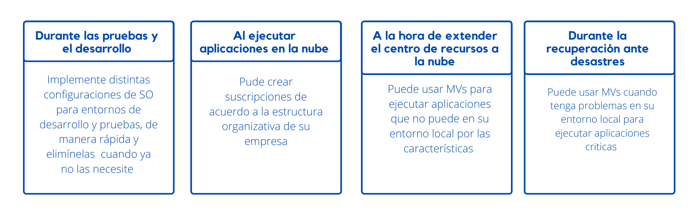
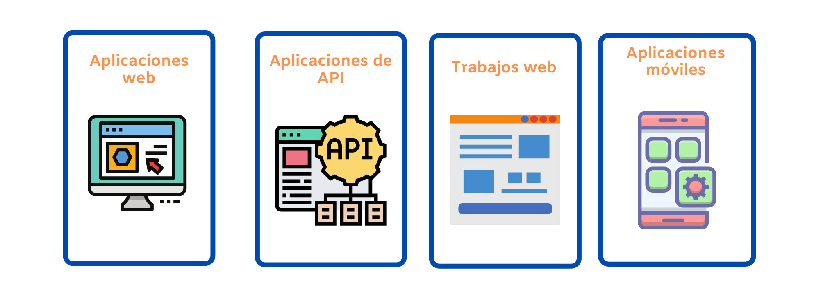

# Servicios básicos de Azure

## Servicios de Azure Compute :computer:

Azure compute es el servicio de informatica en la nube que ofrece infreaestructura como discos, memoria, redes, procesadores y SO. Podemos hacer las implememntaciones de estos recursos en minitos o segundo y solo se pagamos por que usamos.

### Virtual machines (Máquinas virtuales)

Las máquinas virtuales son emulaciones de software de equipos físicos. Incluyen un procesador virtual, memoria, almacenamiento y recursos de red.

#### Características 
* IaaS. 
* Servicio vitualizado.
* Puede personalizar el software. 
* No hay necesidar de mantener el hardware físico que ejecura la MV pues el proveedor de la nube se encarga de eso.
* Implemetaciones de MV en segundos. 

#### Ejemplos de cuándo usar máquinas virtuales

 
    <strong></strong>
    </strong>

### Escalado de máquinas virtuales en Azure

Máquinas vituales únicas para: 
* Pruebas.
* Desarrollo. 
* Tareas decundarias.
* Alta disponibilidad. 
* Redundacia. 
* Escalabilidad. 
  
### Virtual machine scale sets (Conjuntos de escalado de máquinas virtuales)

* Crear y administar un conjunto de MVs idénticas. 
* Escalado automático verdadero. 
* Configurar y actualiza un conjunto de MVs idénticas. 
* Las intacias de MVs puede aumnetar o disminuir de acurdo a la demanda y este proceso lo puede hacer automáticamente o manualmente.
* Cree serivios a gran escala como procesos y macrodatos  
  
### ¿Qué es Azure Batch?

Podemos trabajar por lotes paralelos de gran escala y informática de alto rendimiento (HPC) con la capacidad de escalar a decenas, cientos o miles de MVs.

#### Cuando esté listo para ejecutar un trabajo, Batch:
* Iniciará un grupo de MVs de proceso de forma automática.
* Instalará aplicaciones y datos de almacenamiento provisional.
* Ejecutará trabajos con tantas tareas como tenga.
* Identificará errores.
* Reordenará la cola de trabajo.
* Reducirá verticalmente el grupo a medida que se complete el trabajo.

### Containers 

#### ¿Qué son los contenedores?

* Entorno de vitualización. 
* Ejecucución de varias MVs en un solo hots.
* No se administra el SO.
* Responde a los cambios a petición.

#### Administrar contenedores
Los contenedores se administran a través de un orquestador por el medio del cual se pueden iniciar, detener y escalar las intacias de la app.

Estas son las dos maneras en las que podemos administrar contenedores:

##### Azure Container Instances
* Rapidez y sencilles al ejecutar un contenedor.
* Sin administración de MVs.
* Paas.
* Cargar contenedores que se ejecuten automáticamente.

##### Azure Kubernetes Service
* Administración de una gran cantidad de contenedores.
* Orquestación de contedores con arquitetura distribuida.
  
#### Uso de contenedores en las soluciones
 Arquitectura de **microservicios** donde divides una soulución partes pequeñas e independientes.

### App Service

* Crear y hopedar aplicaciones web.
* Paas
* Compatible con Windows y Linux
  
 #### Tipos de servicios de aplicaciones 

 
    <strong></strong>
    </strong>

| ||
|-------------------------------------------------------------------------- | --------------- |
| Apps Web    | Compatible con ASP.NET, ASP.NET Core, Java, Ruby, Node.js, PHP o Python|  
| App API|  Compatible con Swagger y la posibilidad de empaquetar y publicar la API en Azure Marketplace |
| Trabajos Web |Se puede usar la característica WebJobs para ejecutar un programa (.exe, Java, PHP, Python o Node.js) o un script (.cmd, .bat, PowerShell o Bash). Suelen usarse para ejecutar tareas en segundo plano como parte de la lógica de aplicación.|
| Apps Móvil| Compile rápidamente un back-end para aplicaciones iOS y Android|

#### App Service controla:
* Implementación y administración integrada en la misma plataforma.
* Protege puntos de conexión.
* Escale rápidamente para contolar cargas elevadas de tráfico.
* El equilibrio de carga integrado y el administrador de tráfico proporcionan alta disponibilidad.

### Functions (Funciones) 

## Servicios de red de Azure :globe_with_meridians:
## Servicios de Azure Storage :file_folder:
## Servicios de análisis y bases de datos de Azure:cd:

## :house: [Inicio](https://github.com/JazminQuino/SummerCloud-Grupo-2)