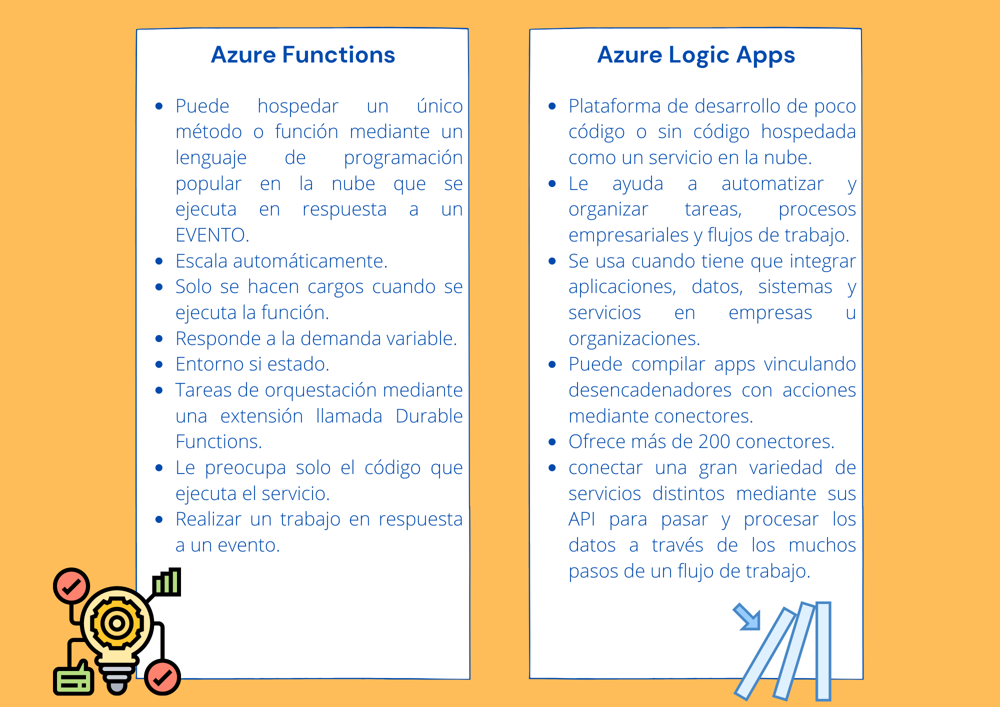

# Elección de la mejor tecnología sin servidor de Azure para su escenario empresarial

 
    <strong></strong>
    </strong>

## ¿Cuál es la diferencia entre estos servicios?
* Puedesn llamarse entre sí.
* Azure Functions es un servicio informático sin servidor, y Azure Logic Apps está diseñado para ser un servicio de orquestación sin servidor.
* Precios diferentes. Azure Functions se basan en el número de ejecuciones y en el tiempo ejecución de cada una. Y Logic Apps se basan en el número de ejecuciones y el tipo de conectores que se usan.

