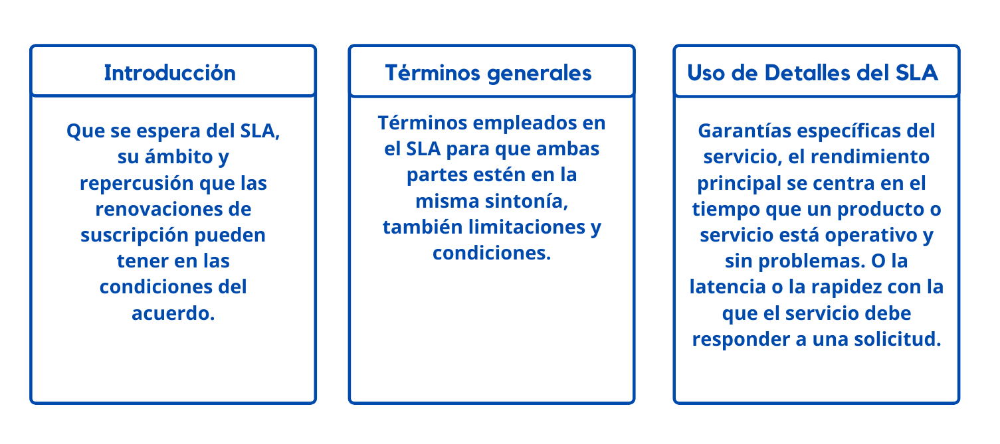
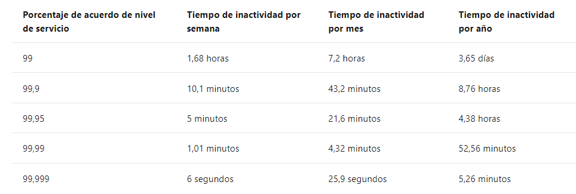

# Elección de los servicios de Azure adecuados según los acuerdos de nivel de servicio y el ciclo de vida del servicio

## ¿Qué son los acuerdos de nivel de servicio (SLA)?
* Contraro fromal entre la empresa del servicio y el cliente.
* Que garantia puedo esperar con los servicios que implemente.
* Cada servicios de Azure tienen su propio SLA.
* 
*Los productos gratuitos no tienen un acuerdo de nivel de servicio, Los servicios como Azure Advisor siempre son gratis. 

## ¿Qué incluye un acuerdo de nivel de servicio típico?

 
    <strong></strong>
    </strong>

## ¿Qué relación hay entre los porcentajes y el tiempo de inactividad total?

 
    <strong></strong>
    </strong>

## Crédito de servicio 
 * El porcentaje del precio que ha pagado que se le abonará conforme al proceso de aprobación de reclamaciones.

# :house: [Inicio](https://github.com/JazminQuino/SummerCloud-Grupo-2)