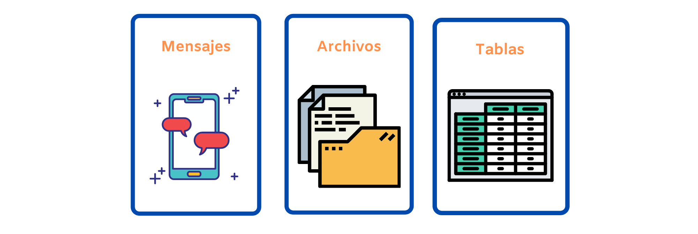
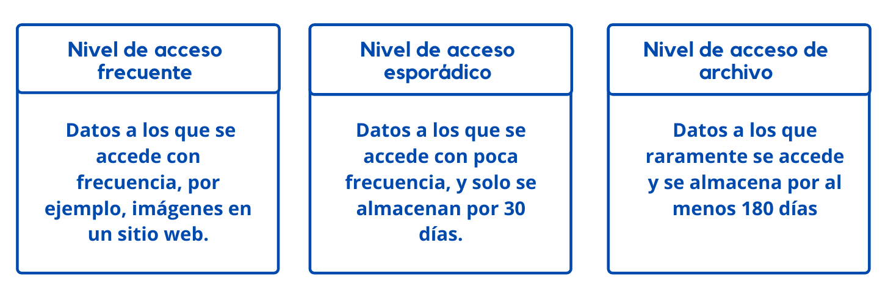

# Servicios de Azure Storage  :file_folder:

## Azure storage

 
    <strong></strong>
    </strong>

Los que  clientes con sus apps puedan leer y escribir datos
  
**IMPORTANTE**
Primero cree una cuenta de Azure Storage, esta cuenta es un espacio único para los datos en Azure Storage. Y es:
- Segura.
- De alta diponibilidad.
- Duraderos

## Azure Blob Storage
* Grandes cantidades de datos como datos binarios o texto.
* No estructurado.
* Administra miles de cargas simultáneas.
* Se pueden acceder desde cualquer lugar con conecxión a Internet.
* No se limita a formatos.
* Los blobs se almacenan en contenedores.
  
Cuando usar Azure Blob Storage:
  * Vizualizar imágenes o docuementos directamente en un explorador.
  * Almacenar archivos para acceso distribuido.
  * Streaming de audio y video.
  * Almacenar Copias de segurdad y restauración.
  * Almacennar datos para ánalisis local o en Azure.
  * Almacenamiento de hasta 8 TB de datos para V.
  

## Azure Disk Storage
* Discos para Azure Virtual Machines.
* Use SSH y HDD estándar para carga de trabajo menos críticas.
* Use SSH Premium para cargas de trabajo críticas.
* Ultra Disks para cargas de trabajo con un uso intensivo de datos como SAP HANA, BD de nivel superior y cargas de trabajo con mucha actividad de transacciones.

## Azure File Storage
* Ofrece recursos compartidos de archivos totalmente administrados en la nube.
* Los recursos compartidos de Azure se pueden montar simultáneamente en implementaciones de Windows, Linux y macOS en la nube o locales.
* Puede tener acceso a los archivos desde cualquier parte con una dirección URL que apunte al archivo.

Los escenarios de uso típicos serían:
* Uso compartido de archivos en cualquier lugar del mundo.
* Los datos de diagnóstico.
* Uso compartido de datos de aplicación.
  
Use Azure Files para las siguientes situaciones:
* Muchas apps locales usan recursos compartidos.
* Almacenar archivos de configuración y acceda desde varias VMs.
* Escriba datos en un recurso compartido de archivos y procese o analice los datos más adelante.

## Niveles de acceso de blob de Azure

 
    <strong></strong>
    </strong>

# :house: [Regresar](https://github.com/JazminQuino/SummerCloud-Grupo-2/blob/main/contenido/semana_dos.md)